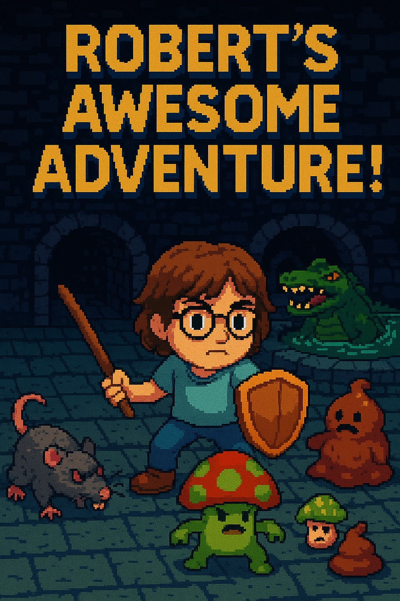

# Robert's Awesome Adventure

## The story

Robert is an inquisitive boy.  He likes to look around, he likes to _investigate_.  One day, he was wandering around the village well.  The well has long since been dry, and so no one really goes down there.  Mainly because it's spooky and over-grown.  As Robert is playing, he hears a noise from inside the well.  A sort of _squelching_.  Keen to see what's making such a strange noise, he leans over the well, sword (stick) in hand to take a closer look, and to vanquish any dragons which might appear!  

Now the well has been in the village for well over 400 years.  It was dug by the druids which originally settled here and built their standing stones and homes.  Their work was sound, but 400 years of weathering will break down the strongest of mortar.  Unfortunately for Robert, he was the one to find that out.

As he leaned over the edge of the well, the bricks gave way, and he tumbled to what would seem to be his death!

## The game
The game is my first **serious** attempt at making a game.  This one is for my Son, who is called, you guessed it! Robert!.

I'll be using pygame, because python is accessible to me, and probably the language I know best.  Also, I just can't be bothered with game engines.  They feel like they're taking the code away.

The game will be a top down dungeon crawler.  This is to play into another of my hobbies.. tabletop gaming.  The game will be short, with only 1 boss at the end, and be aimed at Robert escaping and getting home safe and sound.

That's about it for now.

## Me
I'm not sure how to describe me, so i'll get ChatGPT to do it for me:

**Bio – The Engineer**

Not a hero. Not a protagonist. Definitely not the chosen one. He lives behind the curtain—writing the scripts, wiring the systems, and duct-taping the logic that keeps the whole mess running.

Starting out with BIOS beeps and burnt fingers in the 90s, he cut his teeth as a network consultant for the local council before diving deep into Linux wrangling, infrastructure architecture, and dashboard-induced existential dread. Grafana whispers the truth, Splunk screams it, and New Relic just judges silently in the corner. GCP gets a visit now and then—not a favorite haunt, but useful when needed.

His weapons: Python, Go, and a knack for making unreliable things behave—at least long enough to matter. The mind wanders, sure, but the work gets done. Always. Now, he’s turning that energy toward something different: a game, written for his son. A rare project with no stakeholders, no SLAs—just purpose.

The Engineer isn’t here to play. He’s here to build the world everyone else gets lost in.

## Current Progress
As work gets done, i'll put updates in this section here.  It might include screen-grabs, animations or videos.  Who knows.  At the moment, there's nothing to see here, so be on with you weary traveller of git.  Return soon!

## Credits 
<small>mouse over for details</small>

**Powered by:** 

 

**Other credits**

